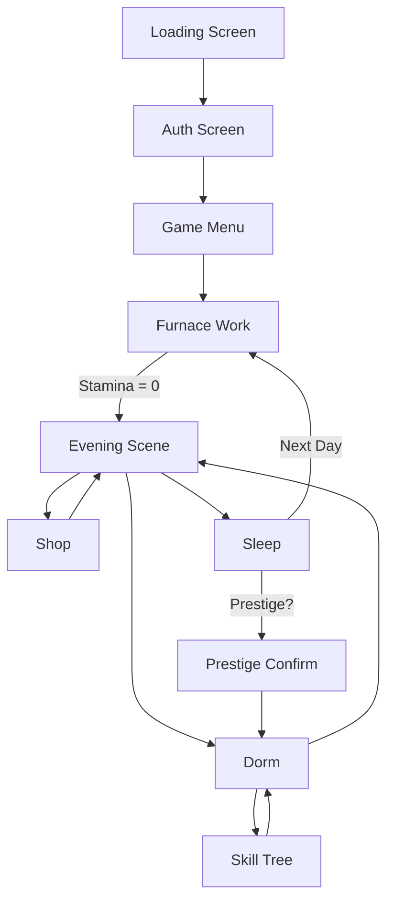

# Scene Network Mapping Guide

## Purpose

A scene network map visualizes all scenes in your game and how players can navigate between them. This helps with:
- Understanding game flow and structure
- Planning navigation UI (buttons, menu options)
- Identifying missing transitions or dead ends
- Documenting the player journey through the game

## Simple Text-Based Approach

For a text-based IDE environment, use ASCII art with arrows:

```
[Loading Screen]
    |
    v
[Auth Screen] ---> [Game Menu]
                       |
                       +---> [Furnace Work]
                       |         |
                       |         v
                       |     [Evening Scene]
                       |         |
                       |         +---> [Shop]
                       |         |
                       |         +---> [Dorm/Skill Tree]
                       |         |
                       |         v
                       |     [Sleep] ---> (loops to Furnace Work)
                       |
                       +---> [ATM Scene]
                       |
                       +---> [Settings]
```

## Detailed Notation

Use annotations to show conditions and special transitions:

```
[Copper Era - Furnace Work]
    |
    +---> [Evening] (automatic when stamina/focus = 0)
            |
            +---> [Shop] (button press)
            |       |
            |       +---> [Evening] (back button)
            |
            +---> [Dorm] (if prestige unlocked)
            |       |
            |       +---> [Skill Tree UI] (overlay)
            |       |
            |       +---> [Evening] (back button)
            |
            +---> [Sleep] (button press)
                    |
                    +---> [Furnace Work] (next day starts)
                    |
                    +---> [Prestige Confirm] (if eligible)
                            |
                            +---> [Dorm/Skill Tree] (prestige executed)
```

## Mermaid Flowchart (For Documentation)

If you want a more visual representation for documentation, use Mermaid syntax (renders on GitHub, in some IDEs, and documentation tools):



Save this in a `.md` file and it will render as a flowchart on GitHub.

## Tabular Format

For complex games with many scenes, a table works well:

| Scene Name | Accessible From | Navigation Method | Conditions | Leads To |
|------------|-----------------|-------------------|------------|----------|
| Loading Screen | Game start | Automatic | None | Auth Screen |
| Auth Screen | Loading Screen | Automatic | None | Game Menu |
| Game Menu | Auth Screen | Automatic | Authenticated | Furnace Work, ATM, Settings |
| Furnace Work | Game Menu, Evening (sleep) | Button, automatic | None | Evening (auto at stamina=0) |
| Evening | Furnace Work | Automatic | End of day | Shop, Dorm, Sleep |
| Shop | Evening | Button | None | Evening |
| Dorm | Evening | Button | Prestige unlocked | Skill Tree, Evening |
| Skill Tree | Dorm | Overlay | Prestige unlocked | Dorm |
| Sleep | Evening | Button | None | Furnace Work (next day) OR Prestige Confirm |
| Prestige Confirm | Sleep | Conditional | Eligible for prestige | Dorm (reset) |
| ATM | Game Menu | Button | Currency unlocked | Game Menu |

## Implementation Integration

Once you have the map, translate it into code:

### In Global.gd:
```gdscript
# Scene registry
const SCENES = {
    "loading_screen": "res://level1/loading_screen.tscn",
    "auth": "res://ui/auth_screen.tscn",
    "game_menu": "res://ui/game_menu.tscn",
    "furnace_work": "res://level1/furnace_work.tscn",
    "evening": "res://level1/evening.tscn",
    "shop": "res://level1/shop.tscn",
    "dorm": "res://level1/dorm.tscn",
    "atm": "res://level1/atm.tscn"
}

# Navigation validation
func can_navigate_to(scene_key: String) -> bool:
    match scene_key:
        "dorm":
            return Level1Vars.prestige_unlocked
        "atm":
            return Level1Vars.current_silver > 0 or Level1Vars.current_gold > 0
        _:
            return true  # Most scenes accessible by default
```

## Recommended Approach for GoA

Given your game structure, I recommend:

1. **Start with ASCII art** - Quick, works in any text editor, version control friendly
2. **Create one map per era** - Copper era scenes, silver era scenes, gold era scenes
3. **Document transitions** - Note which buttons/events trigger scene changes
4. **Update during planning** - As you write plan docs, update the scene map

Example for your game:

```
=== COPPER ERA SCENE NETWORK ===

[Game Menu]
    |
    +---> [Furnace Work] (Work Day Scene)
    |         |
    |         | (stamina/focus depleted)
    |         v
    |     [Evening Scene]
    |         |
    |         +---> [Shop] (upgrades)
    |         |       |
    |         |       +---> [Evening] (back)
    |         |
    |         +---> [Dorm] (if unlocked)
    |         |       |
    |         |       +---> [Skill Tree] (overlay)
    |         |       |
    |         |       +---> [Evening] (back)
    |         |
    |         +---> [Sleep]
    |                 |
    |                 +---> [Furnace Work] (new day)
    |                 |
    |                 +---> [Prestige UI] (if eligible)
    |
    +---> [ATM] (currency exchange)
    |       |
    |       +---> [Game Menu] (back)
    |
    +---> [Settings]
            |
            +---> [Game Menu] (back)

=== SILVER ERA ADDITIONS ===

[Game Menu]
    |
    +---> [Shift Selection] (choose overseer)
            |
            +---> [Shift Work Scene] (similar to Furnace Work)
                    |
                    v
                [Shift Complete] ---> [Game Menu]
```

## Next Steps

1. Create `scene-network-map.md` in `.claude/docs/`
2. Start with copper era scenes
3. Add details as you write plan docs for each feature
4. Reference the map when planning navigation UI
5. Update as new scenes are added

This map becomes a living document that grows with your planning process.
