# Scene Network

**Goal**: Create all Level 1 scenes with navigation buttons and establish centralized scene registry for navigation validation

**Scope**: This plan creates the scene structure and navigation system:
- **10 scene files** (.tscn) inheriting from scene_template.tscn
- **Navigation buttons** (Forward Nav and Back Nav) connecting all scenes
- **Scene network system** (.gd) for centralized navigation validation
- **Scene scripts** (.gd) handling ResponsiveLayout and navigation button connections

When implemented, players can navigate between all copper era scenes using the navigation buttons.

**Note**: Action buttons (Shovel Coal, Sleep, etc.) are NOT created in this plan - they will be added by feature-specific implementation plans.

---

## Visual Network Map

**Diagram file**: [2.1-scene-network.mmd](2.1-scene-network.mmd) - **OPEN THIS FILE to easily copy/edit the diagram**

can open mmd in mermaid chart online

### How to Edit the Diagram

**Easy workflow:**

1. **Open** [2.1-scene-network.mmd](2.1-scene-network.mmd) in VS Code
2. **Select all** (Ctrl+A) and **copy** (Ctrl+C) - the whole file is just the diagram code
3. **Click** the Mermaid Live Editor link above
4. **Paste** the code - you'll see the visual diagram instantly
5. **Edit** in the GUI - drag nodes, change text, add/remove connections
6. **Copy** the updated code from the editor
7. **Paste** it back into the .mmd file (overwrites everything)
8. **Tell me** to sync it back to this plan doc (or don't - the .mmd file is the source of truth)

**VS Code preview**: Install "Markdown Preview Mermaid Support" extension, then you can preview .mmd files and this plan doc with rendered diagrams.

### Current Diagram Preview

**IMPORTANT**: The .mmd file is the source of truth for connections. The preview below only lists scenes - see [2.1-scene-network.mmd](2.1-scene-network.mmd) for navigation arrows.

```mermaid
graph TB
    %% See 2.1-scene-network.mmd for connections - this preview ONLY shows scenes
    %% Actions listed in nodes are for planning reference only - not created in this plan

    furnace["<b>Furnace</b><br/>---<br/>Actions:<br/>- Shovel Coal<br/>- Buy Auto-Shovel"]
    bar["<b>Bar</b><br/>---<br/>Actions:<br/>- (list here)"]
    shop["<b>Shop</b><br/>---<br/>Actions:<br/>- (upgrades)"]
    dorm["<b>Dormitory</b><br/>---<br/>Actions:<br/>- Sleep"]
    carriage["<b>Coppersmith Carriage</b><br/>---<br/>Actions:<br/>- (list here)"]
    atm["<b>ATM</b><br/>---<br/>Actions:<br/>- Withdraw<br/>- Deposit"]
    secret["<b>Secret Passage</b><br/>---<br/>Actions:<br/>- Investigate"]
    puzzle["<b>Secret Puzzle</b><br/>---<br/>Actions:<br/>- Solve"]
    office["<b>Overseer Office</b><br/>---<br/>Actions:<br/>- Bribe"]
    mind["<b>Mind</b><br/>---<br/>Actions:<br/>- (mental)"]
    mess["<b>Mess Hall</b><br/>---<br/>Actions:<br/>- Eat Rations"]

    classDef copperScene fill:#5c2e00,stroke:#9a6229,stroke-width:2px,color:#fff
    class furnace,bar,shop,dorm,carriage,atm,secret,puzzle,office,mind,mess copperScene
```



### Diagram Legend

- **Solid arrows with no label** (`==>`) = **Bidirectional Navigation**
  - Origin scene gets a **Forward Nav button** (light blue, 2px border) leading to destination
  - Destination scene gets a **Back Nav button** (navy blue, 1px border) returning to origin
  - One arrow represents BOTH navigation directions
- **Node contents**:
  - Scene name (bold at top)
  - **Currency Display Indicator** (line after title):
    - `c` = Add currency display component showing ALL currencies (copper, holes, knots, etc.) to this scene's Menu (see 1.x-currency-display.md)
    - **NO `c`** = DO NOT add currency display (scene has no currency UI)
    - Position: Top of Menu VBoxContainer, before action buttons
    - Component: `CurrencyDisplay` configured to show all currency types
    - Auto-updates via `Global.refresh_all_currency_displays()` (see 1.x-currency-display.md)
  - Actions: Listed for planning reference only (NOT created in this plan - added by feature plans)
  - Forward Nav: Created in this plan (light blue, middle of menu)
  - Back Nav: Created in this plan (navy, bottom of menu)
  - Settings button always at bottom (inherited from template, not shown in diagram)

### Quick Reference for Editing

**Add a scene node** (in [2.1-scene-network.mmd](2.1-scene-network.mmd)):
```mermaid
newscene["<b>New Scene</b><br/>---<br/>Actions:<br/>- Action 1"]
```

**Add bidirectional navigation** (one arrow creates both forward and back buttons):
```mermaid
sceneA ==> sceneB
```
This creates:
- Forward Nav button in sceneA that leads to sceneB
- Back Nav button in sceneB that returns to sceneA

**Change button lists**: Edit the text inside the `["..."]` brackets in the .mmd file

---

**Success Criteria**:
- Scene network dictionary with paths and connections (built from .mmd file)
- Validator integrated with Global scene management (1.9)
- Helper functions for navigation checks and scene queries
- All navigation buttons functional between scenes
- Easy to extend as new scenes are added
- Unit tests for network validation logic

**Prerequisites**:
- Phase 1.12: Scene Template (scene_template.tscn exists for inheritance)
- Phase 1.10: Responsive Layout (ResponsiveLayout.apply_to_scene() available)
- Phase 1.13: Button Hierarchy (button styles defined: light blue, navy)
- Phase 1.8: Scene Management (Global.change_scene() and validation framework)

**Reference Docs**:
- [level1-scene-standards.md](level1-scene-standards.md) - UI/content standards for Level 1 scenes

---

## Overview

**CRITICAL: [2.1-scene-network.mmd](2.1-scene-network.mmd) is the SOURCE OF TRUTH**

Before implementing ANY part of this plan, you MUST first open and read [2.1-scene-network.mmd](2.1-scene-network.mmd). That diagram defines:
- **Which scenes to create** (each node = one scene)
- **Which buttons each scene has** (listed in each node)
- **Which scenes connect to each other** (arrows = navigation)

The .mmd file may be updated independently of this plan document. Always read the .mmd file to get the current, accurate scene list and connections. This plan provides the implementation HOW, the .mmd file provides the implementation WHAT.

The scene network provides a **centralized registry** of all Level 1 scenes with their connections. This integrates with the generic validation framework from Phase 1.9 to control navigation throughout the game. As new scenes are added, they're registered in this network.

### Key Design Principles

- **Single Source of Truth**: All Level 1 scenes and connections in one file (scene_network.gd)
- **Visual Source of Truth**: Scene list and connections defined in .mmd file for easy editing
- **Incremental Growth**: Add scenes as features are planned
- **Centralized Modification**: Change connections in one place
- **Extensible**: Easy to add new scenes without refactoring
- **Self-Documenting**: Network structure is the documentation

---

## Architecture Overview

### Data Flow

```
Player clicks navigation button
  -> Request scene change via Global.change_scene()
  -> Global runs validators (including scene network validator)
  -> Network checks: Is destination in network? Is it connected from current scene?
  -> If valid: Scene changes
  -> If invalid: Show message, block transition
```

### Component Separation

- **Phase 1.9 (Scene Management)**: Generic validation framework
- **This Phase (2.2)**: Level 1 specific scene network and rules
- **Feature Plans**: Individual scenes and their content

### File Structure

```
level1/
  scene_network.gd         # This plan - all Level 1 navigation
  furnace.gd/tscn         # Individual scene files
  bar.gd/tscn
  shop.gd/tscn
  ... (other scenes)
```

---

## Implementation Tasks

### 1. Create All Scene Files from Template

**IMPORTANT: The scene list is defined in [2.1-scene-network.mmd](2.1-scene-network.mmd) - that is the source of truth.**

Before implementing, open [2.1-scene-network.mmd](2.1-scene-network.mmd) and identify all scenes in the diagram. Each node in the flowchart represents a scene to create.

**For each scene in the .mmd diagram, create the actual .tscn file:**

All scenes inherit from `res://level1/scene_template.tscn` (from plan 1.12-scene-template.md).

**Process:**
1. Open [2.1-scene-network.mmd](2.1-scene-network.mmd) and read the complete scene list
2. For each scene node in the diagram, note:
   - Scene name (e.g., "Furnace", "Bar", "Dormitory")
   - Buttons listed in that node
   - Connections (arrows) to/from other scenes
3. Create a .tscn file for each scene

**For each scene:**
1. In Godot editor: Right-click `level1/scene_template.tscn` -> "New Inherited Scene"
2. Rename root node from "SceneRoot" to scene name (e.g., "Furnace", "Bar")
3. Add scene-specific content to `mainarea/Menu` and `mainarea/PlayArea`
4. Attach script (see section below)
5. Save as appropriate filename

**Scene structure** (all scenes inherit this from template):
```
SceneName (Control) - Root node, renamed for each scene
├── Background (ColorRect) - Auto-loaded by ResponsiveLayout
├── AspectContainer (AspectRatioContainer)
│   └── MainContainer (Control)
│       ├── Background (TextureRect) - Background image
│       ├── mainarea (HBoxContainer)
│       │   ├── PlayArea (Control) - 66% width, left side
│       │   └── Menu (VBoxContainer) - 33% width, right side
│       │       ├── [CurrencyDisplay] - IF "c" indicator in .mmd (top position)
│       │       ├── [Action Buttons] - Added by feature plans
│       │       ├── [Forward Nav Buttons] - Add here (light blue, 2px border)
│       │       ├── [Back Nav Buttons] - Add here (navy blue, 1px border)
│       │       └── SettingsButton (Button) - Already in template
│       └── NotificationBar (VBoxContainer) - Bottom area
```

**Currency Display Components:**

**IMPORTANT - Only add if "c" indicator is present:**

Check [2.1-scene-network.mmd](2.1-scene-network.mmd) for each scene:
- **IF scene has `c`** (e.g., `dorm["<b>Dorm<br>c</b>"]`) → Add CurrencyDisplay component
- **IF scene has NO `c`** (e.g., `bar["<b>Bar</b>"]`) → DO NOT add CurrencyDisplay

**If `c` indicator is present, add CurrencyDisplay:**

1. Instance `res://ui/currency_display.tscn` (from plan 1.x-currency-display.md)
2. Add as first child of `mainarea/Menu` (top position)
3. Configure to display ALL currencies (copper, holes, knots, etc.)
4. Component auto-updates via `Global.refresh_all_currency_displays()` (from 1.x-currency-display.md)

**Example from current .mmd:**
- ✅ Dorm: Has `c` indicator → DOES get currency display
- ❌ Bar: NO `c` indicator → Does NOT get currency display
- ❌ Furnace: NO `c` indicator → Does Not get currency display

**Note**: Action buttons will be added later by feature-specific plans after the currency display.

---

### 2. Add Navigation Buttons to Each Scene

**IMPORTANT: Navigation connections are defined by arrows in [2.1-scene-network.mmd](2.1-scene-network.mmd) - read that file to see what connections exist.**

**Forward Nav buttons** (light blue, 2px border):
- Appear in scenes that have **outgoing arrows** to other scenes
- Positioned in middle of Menu VBoxContainer (after action buttons)
- Text format: "[Scene Name]"

**Back Nav buttons** (navy blue, 1px border):
- Appear in scenes that have **incoming arrows** from other scenes
- Positioned near bottom of Menu VBoxContainer (before Settings button)
- Text format: "[Scene Name]"

**Process:**
1. Open [2.1-scene-network.mmd](2.1-scene-network.mmd)
2. For each scene, look at the arrows:
   - **Outgoing arrows** (`sceneA --> sceneB`) = SceneA gets a Forward Nav button to SceneB
   - **Incoming arrows** (`sceneA --> sceneB`) = SceneB gets a Back Nav button to SceneA
3. Create Button nodes for each connection
4. Button node naming convention:
   - Forward: `To[SceneName]Button` (e.g., `ToMindButton`)
   - Back: `To[SceneName]Button` (e.g., `ToFurnaceButton`)

**Example from current .mmd file:**
```
furnace --> n1["Mind"]
```
- **Furnace** gets Forward Nav button: `ToMindButton` with text "Mind"
- **Mind** gets Back Nav button: `ToFurnaceButton` with text "Furnace"

```
dorm --> bar & carriage
```
- **Dorm** gets two Forward Nav buttons:
  - `ToBarButton` with text "Bar"
  - `ToCarriageButton` with text "Coppersmith Carriage"
- **Bar** gets Back Nav button: `ToDormButton` with text "Dormitory"
- **Carriage** gets Back Nav button: `ToDormButton` with text "Dormitory"

**Implementation:**
- Add Button nodes to `mainarea/Menu/` in each scene
- Apply appropriate style (light blue for Forward Nav, navy for Back Nav - from plan 1.13-button-hierarchy.md)
- Connect to navigation handler in scene script (see section 4)
- Handler calls `Global.change_scene()` via SceneNetwork helper

---

### 3. Create Scene Scripts

**Each scene needs a script to handle ResponsiveLayout and button connections:**

**Template script pattern** (e.g., `res://level1/furnace.gd`):
```gdscript
extends Control

func _ready():
    ResponsiveLayout.apply_to_scene(self)  # REQUIRED
    connect_navigation()

func connect_navigation():
    # Connect navigation buttons (example - adjust based on .mmd connections)
    $AspectContainer/MainContainer/mainarea/Menu/ToMindButton.pressed.connect(func(): navigate_to("mind"))

func navigate_to(scene_id: String):
    var path = SceneNetwork.get_scene_path(scene_id)
    if path.is_empty():
        push_error("Unknown scene ID: " + scene_id)
        return
    Global.change_scene(path)
```

**Note**: Action buttons and their handlers will be added by feature-specific implementation plans.

**Create scripts for all scenes listed in [2.1-scene-network.mmd](2.1-scene-network.mmd):**

**Process:**
1. For each scene in the .mmd file, create a corresponding .gd script
2. Script filename = scene name converted to snake_case
   - Example: "Furnace" → `furnace.gd`
   - Example: "Coppersmith Carriage" → `coppersmith_carriage.gd`
   - Example: "Secret Passage" → `secret_passage.gd`

**Each script:**
- Extends Control
- Calls `ResponsiveLayout.apply_to_scene(self)` in `_ready()`
- Connects navigation buttons to `navigate_to(scene_id)` helper
- Uses `SceneNetwork.get_scene_path()` to get paths from scene IDs

---

### 4. Scene Network Data Structure

**IMPORTANT: Build this dictionary by reading [2.1-scene-network.mmd](2.1-scene-network.mmd) - the diagram defines all scenes and connections.**

**File Location**: `res://level1/scene_network.gd`

**Process for building the dictionary:**
1. Open [2.1-scene-network.mmd](2.1-scene-network.mmd)
2. For each scene node in the diagram, create an entry in SCENE_NETWORK
3. For each arrow connection in the diagram, add to BOTH scenes' "connections" arrays (bidirectional)
4. Scene IDs should be snake_case versions of scene names

**Dictionary structure example:**
```gdscript
extends Node

# Complete navigation map for Level 1
# Built from 2.1-scene-network.mmd
const SCENE_NETWORK = {
	"furnace": {
		"path": "res://level1/furnace.tscn",
		"name": "Furnace",
		"connections": ["bar", "shop", "dream"],  # From arrows in .mmd
	},

	"bar": {
		"path": "res://level1/bar.tscn",
		"name": "The Bar",
		"connections": ["furnace", "coppersmith_carriage", "dorm", "secret"],
	},

	"shop": {
		"path": "res://level1/shop.tscn",
		"name": "Shop",
		"connections": ["furnace"],
	},

	# ... (continue for all scenes in .mmd file)
}
```

**Structure Fields**:
- `path`: Absolute path to .tscn file
- `name`: Display name for notifications
- `connections`: Array of scene IDs this scene can navigate to (must be bidirectional with arrows in .mmd)

**Implementation Details**:
- Dictionary keys are scene IDs (short names like "furnace", "bar", "secret")
- `connections` uses IDs, not paths
- Since arrows in .mmd are bidirectional, both scenes must list each other in connections
- Example: `furnace ==> bar` means furnace lists "bar" AND bar lists "furnace"

---

### 5. Helper Functions

**Navigation checks**:
```gdscript
# Check if player can navigate to a scene
func can_navigate_to(scene_id: String) -> bool:
	# Scene not in network? Block it
	if not scene_id in SCENE_NETWORK:
		return false

	# Check if connected from current scene
	var current_id = _path_to_id(Global.get_current_scene_path())

	# If no current scene (initial load), allow any scene in network
	if current_id.is_empty():
		return true

	# Current scene not in network? Block transition
	if not current_id in SCENE_NETWORK:
		return false

	var current_scene = SCENE_NETWORK[current_id]
	var connections = current_scene.get("connections", [])

	# Must be in connections list
	return scene_id in connections

# Convert scene path to ID
func _path_to_id(path: String) -> String:
	for scene_id in SCENE_NETWORK:
		if SCENE_NETWORK[scene_id].path == path:
			return scene_id
	return ""

# Convert scene ID to path
func get_scene_path(scene_id: String) -> String:
	if scene_id in SCENE_NETWORK:
		return SCENE_NETWORK[scene_id].path
	return ""
```

**Query functions**:
```gdscript
# Get scenes connected from current scene
func get_available_destinations() -> Array:
	var current_id = _path_to_id(Global.get_current_scene_path())
	if current_id.is_empty() or not current_id in SCENE_NETWORK:
		return []

	var current_scene = SCENE_NETWORK[current_id]
	return current_scene.get("connections", [])
```

---

### 6. Global Validator Integration

**Register validator on autoload**:
```gdscript
func _ready():
	# Autoload: Register scene network validator
	Global.register_scene_validator(_validate_scene_network)

# Validator function
func _validate_scene_network(scene_path: String) -> bool:
	var scene_id = _path_to_id(scene_path)

	# Not in network? Block it
	if scene_id.is_empty():
		push_warning("Attempted to load scene not in network: " + scene_path)
		return false

	# Check if can navigate
	if not can_navigate_to(scene_id):
		var scene = SCENE_NETWORK[scene_id]
		var scene_name = scene.get("name", scene_id)
		Global.show_stat_notification("You can't reach " + scene_name + " from here")
		return false

	return true
```

**Implementation Details**:
- Validator runs on every scene change (via Global.change_scene)
- Blocks ALL scenes not in network (strict validation)
- Shows user-friendly message when blocked
- Returns bool: true = allow, false = block

---

### 7. Autoload Registration

**In** `project.godot`:
```ini
[autoload]

# ... existing autoloads ...
SceneNetwork="*res://level1/scene_network.gd"
```

**Why autoload?**
- Available from anywhere via `SceneNetwork.can_navigate_to()`
- Registers validator automatically on game start
- Singleton pattern for centralized network

---

## Code Examples

### Adding a New Scene to Network

```gdscript
# In SCENE_NETWORK dictionary
"new_scene": {
	"path": "res://level1/new_scene.tscn",
	"name": "New Area",
	"connections": ["bar", "other_scene"],  # Where can you go from here?
}

# Don't forget to add "new_scene" to the connections of scenes that connect TO it
# Example: If bar connects to new_scene, add "new_scene" to bar's connections array
```

### Navigating to a Scene

```gdscript
# From any scene script
func _on_bar_button_pressed():
	# Option 1: Direct path
	Global.change_scene("res://level1/bar.tscn")

	# Option 2: Via scene ID (requires SceneNetwork helper)
	var path = SceneNetwork.get_scene_path("bar")
	Global.change_scene(path)
```

### Checking Available Destinations

```gdscript
# For dynamic navigation UI
func _update_navigation_buttons():
	var available = SceneNetwork.get_available_destinations()

	for scene_id in available:
		var scene = SceneNetwork.SCENE_NETWORK[scene_id]
		var button_text = scene.name
		# Create/show button with button_text
```

---

## Testing Strategy

### Unit Tests

Create `tests/test_scene_network.gd`:

```gdscript
extends GutTest

# Test: Scene exists in network
func test_scene_in_network():
	assert_true("furnace" in SceneNetwork.SCENE_NETWORK, "Furnace in network")
	assert_true("bar" in SceneNetwork.SCENE_NETWORK, "Bar in network")

# Test: Path to ID conversion
func test_path_to_id():
	var id = SceneNetwork._path_to_id("res://level1/furnace.tscn")
	assert_eq(id, "furnace", "Path converts to ID")

# Test: ID to path conversion
func test_id_to_path():
	var path = SceneNetwork.get_scene_path("bar")
	assert_eq(path, "res://level1/bar.tscn", "ID converts to path")

# Test: Navigation allowed from connected scene
func test_navigation_connected():
	# Note: Requires mocking current scene
	# This is more of an integration test
	pass

# Test: Navigation blocked from unconnected scene
func test_navigation_unconnected():
	# Example: Can't reach office directly from furnace (not connected)
	# Would need to mock current scene as furnace
	pass

# Test: Scene not in network is blocked
func test_unknown_scene_blocked():
	var unknown_path = "res://level1/nonexistent.tscn"
	var scene_id = SceneNetwork._path_to_id(unknown_path)
	assert_eq(scene_id, "", "Unknown scene has empty ID")
	assert_false(SceneNetwork.can_navigate_to("nonexistent"), "Unknown scene blocked")
```

**Run tests:**
```bash
godot --headless --script res://addons/gut/gut_cmdln.gd -gtest=tests/test_scene_network.gd
```

### Integration Tests

| Scenario | Setup | Action | Expected Result |
|----------|-------|--------|-----------------|
| Navigate to connected scene | In bar | Change to furnace | Transition succeeds |
| Navigate to unconnected scene | In furnace | Try to go to office directly | Blocked, shows "can't reach" |
| Navigate from initial load | Game starts | Load any scene in network | Allowed (no current scene) |
| Navigate to unknown scene | In bar | Try to load scene not in network | Blocked with warning |

### Manual Test Criteria

**Scene Creation:**
- [ ] Open [2.1-scene-network.mmd](2.1-scene-network.mmd) and verify every scene in diagram has a .tscn file
- [ ] All scenes properly inherit from scene_template.tscn
- [ ] All scenes have correct root node names (matching scene names from diagram)
- [ ] All scenes display at correct resolution (1280x720 and 1920x1080)

**Button Presence:**
- [ ] Open [2.1-scene-network.mmd](2.1-scene-network.mmd) and verify navigation buttons match arrow connections
- [ ] All Forward Nav buttons (based on outgoing arrows in diagram) appear in correct scenes
- [ ] All Back Nav buttons (based on incoming arrows in diagram) appear in correct scenes
- [ ] Buttons are styled correctly (light blue for Forward Nav, navy for Back Nav)
- [ ] SettingsButton appears in all scenes (inherited from template)

**Navigation Functionality:**
- [ ] Start game - verify navigation buttons appear as defined in [2.1-scene-network.mmd](2.1-scene-network.mmd)
- [ ] Test navigation along each arrow connection in the diagram - all should work
- [ ] Test Back Nav buttons - all should return to the scene with outgoing arrow
- [ ] Verify Forward Nav and Back Nav buttons match the arrow directions in diagram
- [ ] Try to navigate between unconnected scenes - should block with "Can't reach X from here" message
- [ ] Verify navigation messages are clear and user-friendly

**Script Functionality:**
- [ ] ResponsiveLayout.apply_to_scene() runs in all scenes without errors
- [ ] All navigation buttons trigger scene changes
- [ ] No console errors when navigating between scenes

**Network Integration:**
- [ ] SceneNetwork autoload is registered and available
- [ ] SceneNetwork.get_scene_path() returns correct paths
- [ ] SceneNetwork.can_navigate_to() correctly validates transitions
- [ ] Strict validation: scenes not in network are blocked
- [ ] Add a new scene to network, verify it integrates properly

---

## Files to Create

**IMPORTANT: The list of scenes is defined in [2.1-scene-network.mmd](2.1-scene-network.mmd). Read that file first to determine exactly which files to create.**

**Scene files (.tscn)** - Create one for each scene in the .mmd diagram:
- All inherit from `res://level1/scene_template.tscn`
- Filename convention: scene name in snake_case (e.g., `furnace.tscn`, `coppersmith_carriage.tscn`)
- Location: `res://level1/[scene_name].tscn`

**Scene scripts (.gd)** - Create one for each scene in the .mmd diagram:
- Handle ResponsiveLayout and button connections
- Filename matches .tscn filename (e.g., `furnace.gd`, `coppersmith_carriage.gd`)
- Location: `res://level1/[scene_name].gd`

**Scene network:**
- `res://level1/scene_network.gd` - Scene network autoload with all Level 1 scenes and connections from .mmd file

## Files to Modify

- `project.godot` - Add SceneNetwork autoload
- `tests/test_scene_network.gd` - Unit tests for network logic

---

## Design Values (Reference)

### Scene Organization

**Hubs** (high connection count):
- `bar` - Main hub, connects to multiple areas
- `coppersmith_carriage` - Secondary hub, connects to services

**Special Scenes**:
- `dream` - Auto-triggered on stamina depletion, auto-returns
- `shop` - Break timer based, auto-returns to furnace

---

## Dependencies & Integration

### Depends On:
- Phase 1.9 (Scene Management) - Validation framework
- Phase 1.12 (Scene Template) - Template for inheriting scenes
- Phase 1.10 (Responsive Layout) - ResponsiveLayout.apply_to_scene()
- Phase 1.13 (Button Hierarchy) - Button styles

### Used By:
- All Level 1 scenes - Navigation between scenes
- Future UI features - Dynamic navigation buttons
- Feature plans - Add new scenes to network

### Provides APIs For:

**Navigation**:
```gdscript
SceneNetwork.can_navigate_to(scene_id) -> bool
SceneNetwork.get_scene_path(scene_id) -> String
```

**Queries**:
```gdscript
SceneNetwork.get_available_destinations() -> Array
```

**Validation**:
```gdscript
# Automatically registered with Global.scene_validators
```

## Notes & Decisions

**Decision 1**: Dictionary-based structure
- **Rationale**: Simple, readable, easy to modify
- **Benefit**: All scenes visible in one place, no complex classes
- **Alternative**: Graph classes (rejected - overkill for this scale)

**Decision 2**: Scene IDs as dictionary keys
- **Rationale**: Short names easier to type than full paths
- **Benefit**: `can_navigate_to("bar")` vs `can_navigate_to("res://level1/bar.tscn")`
- **Helper**: `get_scene_path()` converts ID to path when needed

**Decision 3**: Connections are bidirectional
- **Rationale**: Each arrow in .mmd represents navigation in BOTH directions
- **Implementation**: Must manually add scene IDs to both scenes' connections arrays
- **Benefit**: Full control, explicit about all connections
- **Note**: If A connects to B, A lists "B" in connections AND B lists "A"

**Decision 4**: Incremental additions expected
- **Rationale**: Not all scenes designed yet
- **Benefit**: Add scenes as features are planned (low friction)
- **Process**: Each feature plan can add its scenes to this network

**Decision 5**: Strict validation, no bypasses
- **Rationale**: Scene network controls ALL Level 1 navigation
- **Benefit**: Centralized control, prevents bugs from unknown scene transitions
- **Note**: Scenes not in network are blocked with warning

---

## Adding New Scenes (Quick Reference)

When planning a new feature that adds a scene:

1. **Add to .mmd diagram**:
   - Add node with scene name and arrow connections
   - This defines the visual source of truth

2. **Add to SCENE_NETWORK in scene_network.gd**:
```gdscript
"new_scene_id": {
	"path": "res://level1/new_scene.tscn",
	"name": "Display Name",
	"connections": ["scene1", "scene2"],  # Where can player go from here?
}
```

3. **Add to existing connections** (bidirectional):
```gdscript
# Find scenes that should connect TO this new scene
# Add "new_scene_id" to their "connections" arrays
# Example: If bar ==> new_scene in .mmd, then:
#   - bar's connections includes "new_scene"
#   - new_scene's connections includes "bar"
```

4. **Create scene files**:
   - Create .tscn inheriting from scene_template.tscn
   - Create .gd script with navigation connections
   - Add navigation buttons as defined in .mmd

5. **Test**:
   - Navigate to/from new scene
   - Verify bidirectional connections work
   - Check messages shown when blocked

**That's it!** The validator and helpers work automatically.

---

## Implementation Checklist

**FIRST: Read [2.1-scene-network.mmd](2.1-scene-network.mmd) to determine the complete list of scenes and connections to implement.**

Before marking Phase 2.1 complete:

**Scene Files Created:**
- [ ] Read [2.1-scene-network.mmd](2.1-scene-network.mmd) to get complete scene list
- [ ] Created .tscn file for EVERY scene in the diagram (inherited from scene_template.tscn)
- [ ] All scene root nodes renamed appropriately (not "SceneRoot")
- [ ] All scenes saved with correct snake_case filenames
- [ ] Currency displays added ONLY to scenes with "c" indicator
  - [ ] Checked [2.1-scene-network.mmd](2.1-scene-network.mmd) for each scene's "c" status
  - [ ] Currency display added to Dorm (has "c" indicator)
  - [ ] Currency display NOT added to scenes without "c" (Bar, Furnace, etc.)
  - [ ] CurrencyDisplay component positioned at top of Menu VBoxContainer
  - [ ] Configured to show ALL currencies (copper, holes, knots, etc.)
  - [ ] Component from `res://ui/currency_display.tscn` (1.x-currency-display.md)

**Navigation Buttons Added:**
- [ ] Read arrow connections from [2.1-scene-network.mmd](2.1-scene-network.mmd)
- [ ] Created Forward Nav buttons for all outgoing arrows (light blue, 2px border)
- [ ] Created Back Nav buttons for all incoming arrows (navy blue, 1px border)
- [ ] Navigation button text shows scene name only (no "To" prefix)
- [ ] Back Nav buttons positioned before Settings button in Menu

**Scene Scripts Created:**
- [ ] Created .gd file for EVERY scene in [2.1-scene-network.mmd](2.1-scene-network.mmd)
- [ ] All scripts extend Control
- [ ] All scripts call `ResponsiveLayout.apply_to_scene(self)` in `_ready()`
- [ ] All navigation buttons connected to `navigate_to(scene_id)` helper

**Scene Network System:**
- [ ] `level1/scene_network.gd` created
- [ ] SCENE_NETWORK dictionary built from [2.1-scene-network.mmd](2.1-scene-network.mmd) (all scenes and connections)
- [ ] `can_navigate_to()` function implemented with strict validation
- [ ] `_path_to_id()` helper function implemented
- [ ] `get_scene_path()` helper function implemented
- [ ] `get_available_destinations()` query function implemented
- [ ] Validator function `_validate_scene_network()` implemented
- [ ] Validator registered with Global on _ready()
- [ ] SceneNetwork autoload registered in project.godot

**Testing:**
- [ ] Unit tests written and passing (5+ tests)
- [ ] Integration tests completed
- [ ] Manual tests verified (navigate between all scenes)
- [ ] All navigation buttons work correctly
- [ ] Scene network validator blocks invalid transitions with strict mode
- [ ] Unknown scenes blocked with warning
- [ ] All scenes display correctly at 1280x720 and 1920x1080
- [ ] ResponsiveLayout.apply_to_scene() works in all scenes

**Documentation:**
- [ ] Documentation updated (this plan serves as docs)
- [ ] Process for adding new scenes documented

---

**Last Updated**: 2025-12-24
**Maintainer**: Claude + User collaboration
**Plan Version**: 2.1.2 (Clarified currency display logic - only scenes with "c" indicator; fixed plan references to use 1.x formatting)
